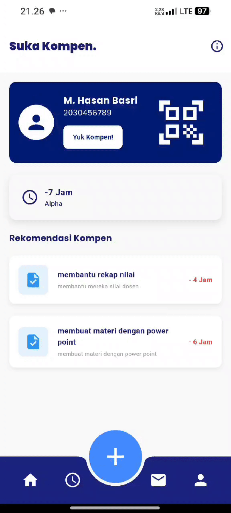

# Sistem Kompensasi Jurusan Teknologi Informasi

Sistem ini dirancang menggunakan Flutter untuk antarmuka pengguna dan Laravel sebagai REST API backend. Sistem bertujuan untuk mengelola proses kompensasi mahasiswa secara efisien dan terintegrasi di Jurusan Teknologi Informasi.

🎥 Demo Video

Berikut adalah tampilan antarmuka pengguna dari sistem kompensasi:



---

## ✨ Fitur Utama

1. **Manajemen Pengguna**: 
   - Mengelola data pengguna sistem (Admin, Dosen, Tenaga Pendidik, Mahasiswa).

2. **Manajemen Bidang Kompetensi**:
   - Mengatur bidang kompetensi untuk tugas kompensasi.

3. **Manajemen Data Mahasiswa Kompen**:
   - Mendukung impor data mahasiswa dari file eksternal.
   - Integrasi API untuk data kehadiran mahasiswa (alpha).

4. **Manajemen Jenis Tugas Kompen**:
   - Mengelola jenis tugas kompensasi yang harus diselesaikan mahasiswa.

5. **Progres Tugas Kompen**:
   - Input progres tugas kompensasi.
   - Unggah hasil tugas kompensasi.
   - Validasi tanda tangan dosen dan kepala program studi.

6. **Laporan dan Daftar Mahasiswa**:
   - Daftar mahasiswa alpha dan mahasiswa kompensasi.
   - Fitur cetak laporan rekapitulasi jam kehadiran dan kompensasi.

7. **Dashboard Interaktif**:
   - Tampilan statistik terkait proses kompensasi.
   - Validasi menggunakan QR Code.

8. **Manajemen Periode Kompen**:
   - Pengaturan periode akademik untuk kompensasi (contoh: 2024-Ganjil, 2024-Genap).

---
## 🖼️ Screenshoot

Berikut adalah tampilan antarmuka pengguna dari sistem kompensasi:


## 🛠️ Teknologi yang Digunakan

### **Frontend**:
- **Flutter**: Framework untuk pengembangan aplikasi mobile multiplatform.
- **Intl**: Untuk pengelolaan format tanggal dan waktu.
- **QR Code Scanner**: Digunakan untuk validasi QR code.

### **Backend**:
- **Laravel**: Framework PHP untuk pengembangan REST API.
- **MySQL**: Database relasional untuk menyimpan data sistem.
- **JWT Authentication**: Untuk autentikasi dan otorisasi pengguna.

---

## 📦 Instalasi

### **Frontend (Flutter):**

1. Clone repository:
   ```bash
   git clone https://github.com/MHasanBas/Kompen.git
   ```

2. Masuk ke direktori proyek:
   ```bash
   cd sistem-kompen-flutter
   ```

3. Install dependensi:
   ```bash
   flutter pub get
   ```

4. Jalankan aplikasi:
   ```bash
   flutter run
   ```

### **Backend (Laravel):**

1. Clone repository:
   ```bash
   git clone <URL_REPOSITORY_BACKEND>
   ```

2. Masuk ke direktori proyek:
   ```bash
   cd sistem-kompen-backend
   ```

3. Install dependensi:
   ```bash
   composer install
   ```

4. Konfigurasi file `.env`:
   - Sesuaikan pengaturan database, seperti nama database, username, dan password.

5. Jalankan migrasi database:
   ```bash
   php artisan migrate
   ```

6. Jalankan server:
   ```bash
   php artisan serve
   ```

---

## ⚙️ Penggunaan

1. **Akses Dashboard**:
   - URL: `http://localhost:8000` (Backend API).
   - URL: `http://localhost:3000` (Flutter Frontend, jika menggunakan emulator).

2. **Fitur Validasi QR Code**:
   - Scan QR Code melalui aplikasi untuk validasi data kompensasi.

---

## 🛠️ Kontributor

- **Nama Anda** - Developer Frontend & Backend
- **Tim Anda** - Kontributor lainnya

---

## 📜 Lisensi

Sistem ini menggunakan lisensi [MIT License](LICENSE).

---

Nikmati sistem kompensasi yang efisien dan terintegrasi!

